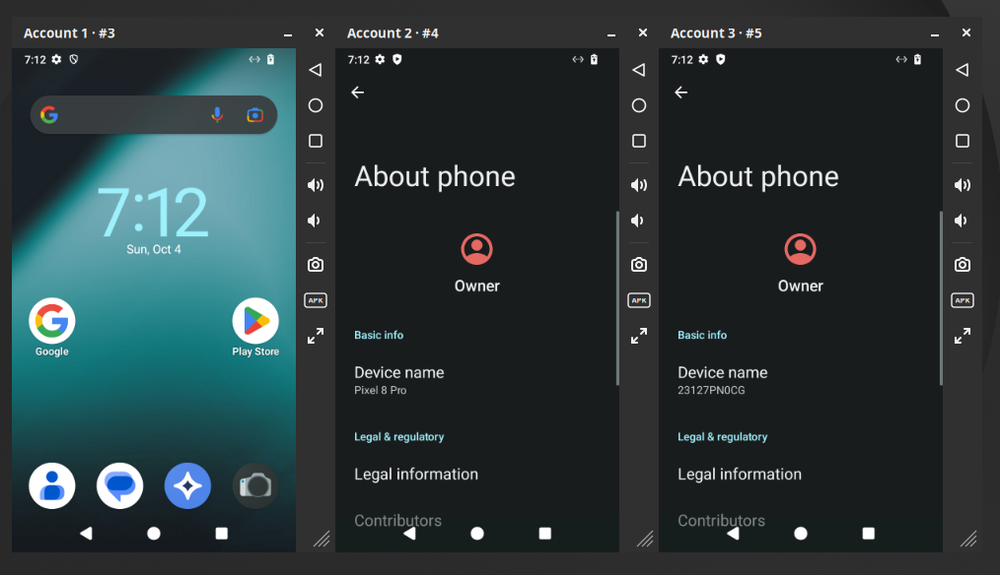
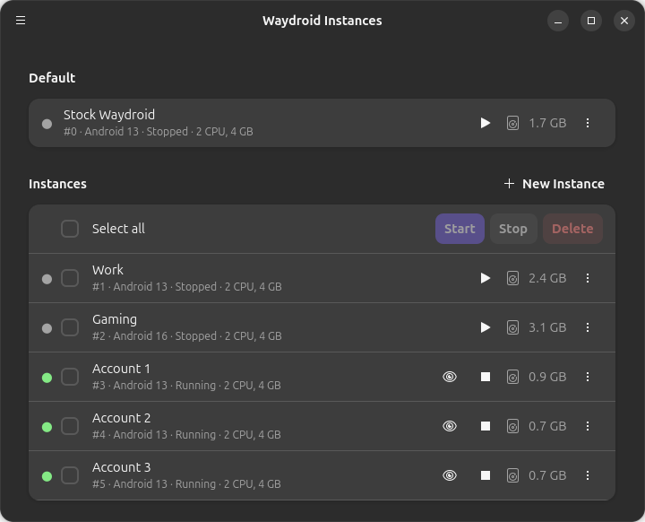

# Waydroid Manager

Create and run **Android devices on Linux** with [Waydroid](https://waydro.id), the way
BlueStacks or LDPlayer do on Windows. Each device is a real Android system running natively
in a container, not an emulator.

- **Android 11, 13, 14, 15, 16 or 17**, chosen per device, all with Google Play
- **Full GPU speed, NVIDIA included**: 3D games run on your graphics card, even with NVIDIA's
  proprietary driver
- **As many devices as your PC can handle**, side by side, each with its own apps, accounts,
  settings, window and network address
- Your normal Waydroid keeps working, and shows up as device **#0**



## What you can do

- Create a fresh device on the Android version you need, or **clone** one (including your
  normal Waydroid) to copy its apps and logins. Clones get their own device identity
- Choose how each device draws: on your **NVIDIA** card, any other GPU, or in software
- Pick a **phone or tablet resolution**, the **CPU and memory** each device may use, and a
  **device model** (Samsung, Pixel, Xiaomi, … or your own) that apps will see
- Every device window has a **title bar and side toolbar**, LDPlayer style:
  - drag the title bar to move it, drag an edge to **resize** (the picture scales, and the size
    is remembered)
  - double-click the title bar to maximize
  - **◁ ○ □** Back / Home / Recents, volume buttons, screenshots, Install APK and fullscreen
  - drop `.apk` files on the window to install them
- Find each device in the dock and app grid under its own name
- Install APKs, launch apps, and use `adb`, per device: running devices show up in
  `adb devices` by name, e.g. `waydroid-account-1:5555`
- Run **ARM-only apps**: each device has ARM translation (Houdini or libndk), or none

## Android versions

Each device runs the Android version picked when it is created (13 unless you choose another).
A version is downloaded the first time a device uses it, and all devices on it share it.

| Android | Build | Google Play | NVIDIA | ARM apps | Download |
|---|---|---|---|---|---|
| 11 | official Waydroid (LineageOS 18.1) | in the image | – | Houdini or libndk | 1.1 GB |
| 13 | official Waydroid (LineageOS 20) | in the image | ✓ | Houdini or libndk | 1.4 GB, nothing when your Waydroid has the same build |
| 14 | [WayDroid-ATV](https://github.com/WayDroid-ATV) (LineageOS 21) | MindTheGapps | ✓ | Houdini, the image's | 1.1 GB + 0.2 GB |
| 15 *(experimental)* | [minhmc2007](https://huggingface.co/datasets/Minhmc2077/My_Binary_Build) (LineageOS 22.2) | MindTheGapps | ✓ | libndk, the image's | 1.2 GB + 0.2 GB |
| 16 | WayDroid-ATV (LineageOS 23.2) | in the image | ✓ | libndk, the image's | 1.6 GB |
| 17 *(experimental)* | WayDroid-ATV (LineageOS 24.0, a pre-release) | in the image | ✓ | libndk, the image's | 1.7 GB |

- **Experimental** means a single maintainer's build (15) or a pre-release of LineageOS (17):
  expect rough edges.
- **Root** (Magisk Delta) works on 11 and 13.
- **Android 15 needs a GPU** (NVIDIA or another): its image can't show frames rendered in software.
  On NVIDIA, opening some screens (Settings' sub-pages, for one) makes the GPU reject a drawing
  command and Android's display restarts; it recovers by itself. This is a known fault of
  waydroid-nvidia's renderer (NVIDIA Xid 69).
- A device's version is fixed: its data can't move to another Android. Clone it to get a copy on
  the same version.
- Android 12 has no Waydroid build.
- MindTheGapps (+ 0.2 GB) is downloaded once for 14 and 15.

## Requirements

- An x86_64 PC running Linux with a Wayland desktop (GNOME, KDE Plasma, …)
- **Waydroid installed and set up**: you can already run `waydroid show-full-ui`
- Kernel modules for the newer images: `squashfs` (Android 15), `erofs` (16, 17) and `videodev`
  (17). Ubuntu's and Debian's kernels have them all.
- **Linux 6.19 or newer to render on NVIDIA, or to render 14 or 17 in software**: Android draws into
  a hidden `vkms` device, which older kernels can't make (Ubuntu 26.04's kernel can, Ubuntu
  24.04's and Debian 13's can't). Devices on another GPU work on any of them.
  `waydroid-manager doctor` checks all of this.
- For NVIDIA cards: NVIDIA's proprietary driver, see [Graphics](#graphics)
- Optional: `wl-clipboard` for clipboard sharing

Tested on Ubuntu 26.04 with Waydroid 1.6 and GNOME 50, on an NVIDIA GeForce RTX 5060 Ti (driver
595) with an AMD Radeon iGPU.

## Install

### Ubuntu 24.04+ and Debian 13+

Download `waydroid-manager_<version>_amd64.deb` from the
[latest release](https://github.com/felipeoes/waydroid-manager/releases/latest), then:

```sh
sudo apt install ./waydroid-manager_*_amd64.deb
```

Updates work the same way: install the newer `.deb`. Running instances keep running.

### Other distributions (from source)

```sh
git clone https://github.com/felipeoes/waydroid-manager.git
cd waydroid-manager
sudo scripts/install.sh
```

Then open **Waydroid Manager** from your app grid. If you installed from source
before, you can switch to the `.deb` at any time; your instances are kept.

## Using the manager app



- **+ New Instance** creates an instance. Instances are numbered automatically: your normal
  Waydroid is **#0**, new ones get the next free number (#1, #2, …).
- **▶** starts an instance, **👁** brings its window back, and **■** stops it.
- **⋮** opens a menu with Settings, Clone, Install APK, Add to/Remove from app grid, and Delete.
- Tick instances' checkboxes (or **Select all**) to start, stop or delete several at once.
- Your normal Waydroid appears under **Default** as #0. It works like any other instance:
  window with title bar and toolbar, Settings, Install APK, app grid entry and Clone. It runs on
  your normal Waydroid's own apps and data, in place. Its app grid entry is the one **Waydroid** icon:
  stock's own is hidden, so opening Waydroid opens #0.

## The instance window

| | |
|---|---|
| Move | drag the title bar |
| Resize | drag any edge |
| Maximize / restore | double-click the title bar |
| Fullscreen | toolbar button or **F11**; leave with **Esc** or **F11** |
| Android buttons | ◁ Back, ○ Home, □ Recents, volume up/down |
| Screenshot | toolbar camera button, saved to `~/Pictures/Waydroid/<instance name>` |
| Install APK | toolbar **APK** button, then pick an `.apk`; or drop `.apk` files on the window |

Closing the window stops the instance after asking you to confirm. In its Settings you can
make closing pause it or keep it running instead.

## Using the command line

Everything in the app can also be done from a terminal. Instances are referred to by their
number or their name:

```sh
waydroid-manager create --name "Account 1"           # new instance (prints its number, e.g. #1)
waydroid-manager clone default --name "Account 2"    # copy your normal Waydroid
waydroid-manager start 1                             # start and open its window
waydroid-manager list                                # see all instances
waydroid-manager app install 1 my-app.apk            # install an app
waydroid-manager config 1 set device_model pixel_7   # what apps see (see: waydroid-manager devices)
waydroid-manager config "Account 1" set cpus 4 memory 6G
waydroid-manager stop 1
waydroid-manager delete 2
```

Run `waydroid-manager --help` to see all commands.

## Graphics

Each device's **Graphics** setting (in Settings, or `config N set gpu …`; it applies at the next
start) decides where Android draws:

| Choice | Where Android draws |
|---|---|
| **Automatic** (default) | on your NVIDIA card when it shows your desktop (Android 13 to 17); otherwise on the GPU your normal Waydroid uses; in software when neither can |
| **Software** | on the CPU: slower, above all in 3D games, but it works on any PC (not with Android 15) |
| **GPU 0, GPU 1, …** | on that card, e.g. your integrated GPU while the desktop runs on NVIDIA |

`waydroid-manager doctor` lists your GPUs and what Automatic picks.

**On NVIDIA** devices need NVIDIA's proprietary driver (`nvidia` or `nvidia-open`) with its
Vulkan driver, and Linux 6.19 or newer. RAID: Shadow Legends runs at 60 fps there, against 9 in software.
- The first start on NVIDIA downloads [waydroid-nvidia](https://github.com/quinovax/waydroid-nvidia)'s
  renderer and Android drivers (about 25 MB).
- Each running device has its own renderer process, which runs as you. Its log is
  `~/.cache/waydroid-manager/renderer-N.log`.
- waydroid-nvidia is young (0.1): a game may hit a driver error, and video memory use grows with
  every device and app.

**Another GPU under a desktop on NVIDIA** (an iGPU, say) works too. GNOME on NVIDIA can't show
that card's buffers directly, so the card copies each frame into memory the desktop can show.

## Good to know

- **Resolution, device model, CPU and memory** changes apply at the next start of the instance.
- **Writable system:** the per-instance "Writable system" switch (`config set N system_writable true`,
  then restart) lets Android change `/system` and `/vendor`, e.g. to install Magisk. Changes live in
  the instance's `overlay_rw/` and are lost when the device moves to a newer Android build. Turning
  it off keeps earlier changes visible but read-only.
- **Root:** the per-instance "Root" switch (`config set N root true`, then restart) installs
  Magisk Delta, the build `waydroid_script` uses, so apps can get root. The first start downloads
  it, so it needs internet. Then install the Magisk app:
  `waydroid-manager app install N /var/lib/waydroid-manager/magisk-delta.apk`. It works on Android
  11 and 13. Official Magisk does not work on Waydroid (no boot image). The switch is open to the
  instance owner, and root in Android is close to root on the host, so only enable it on machines
  you trust.
- **ARM translation:** instances run ARM-only apps through Houdini by default. In Settings, or with
  `config set N arm_translation libndk` (or `none`), pick libndk or turn it off, then restart. The
  first start with each one downloads it (the builds `waydroid_script` uses), so it needs internet;
  without internet the instance starts without it. That choice is for Android 11 and 13: 14 to 17
  run ARM apps on the translation their image comes with, and `none` turns it off.
- **adb:** once Android has started, each instance (#0 too) connects to adb by itself as
  `waydroid-<name>:5555`. For example, `adb -s waydroid-account-1:5555 shell`. Like the Android
  Studio emulator, there is no "Allow USB debugging?" prompt: your adb key is trusted in your own
  instances. The names are kept in a marked block in `/etc/hosts`.
- **Updates:** `waydroid upgrade` updates your normal Waydroid, and #0 with it, as usual. The other
  devices get newer builds of their Android with `waydroid-manager images update` (or **Check for
  Android updates** in the app's menu), and switch to them at their next start.
- **Google Play on a clone:** a clone counts as a new device, so register it once. Run
  `waydroid-manager gsf-id <instance>` and enter the number at
  <https://www.google.com/android/uncertified>.
- **Memory:** each running instance uses about 1.5–3 GB of RAM.
- **Your normal Waydroid (#0):** #0 and plain `waydroid` use the same Android data, so only one
  of them runs at a time: starting #0 stops `waydroid` first, and while #0 runs, `waydroid` can't
  start. Stopping #0 (or uninstalling waydroid-manager) gives it back. #0's settings live in
  waydroid-manager only; plain `waydroid` keeps its own. Two things carry over, because they're stored
  in Android's data: with Root on, Magisk leaves `/data/adb` behind (harmless without it), and a
  different device model makes Google services see a different device when you switch between them.
- **Several users on one computer:** each user sees and controls only their own instances.
  Only the first user who opens waydroid-manager gets their normal Waydroid as #0.
- Running several accounts may be against some apps' or games' terms of service.

## Uninstall

In the manager app, open the menu and choose **Uninstall Waydroid Manager…**. You can keep your
instances or delete them with it. From a terminal:

```sh
sudo apt remove waydroid-manager       # keeps your instances
sudo apt purge waydroid-manager        # also deletes all instances and their data
```

If you installed from source:

```sh
sudo /usr/lib/waydroid-manager/uninstall.sh            # keeps your instances
sudo /usr/lib/waydroid-manager/uninstall.sh --purge    # also deletes all instances and their data
```

Your normal Waydroid is never modified.

## Contributing

See [CONTRIBUTING.md](CONTRIBUTING.md) for how it works inside and how to develop it.

## Third-party software

Waydroid Manager downloads these when first needed, each pinned to a version and checked by
sha256. They keep their own licenses.

| What | From | For |
|---|---|---|
| Android images | [Waydroid](https://waydro.id) (11, 13), [WayDroid-ATV](https://github.com/WayDroid-ATV) (14, 16, 17), [minhmc2007](https://huggingface.co/datasets/Minhmc2077/My_Binary_Build) (15) | the devices |
| MindTheGapps 14 | [MindTheGappsBuilder](https://github.com/s1204IT/MindTheGappsBuilder) | Google Play on 14 and 15 |
| virglrenderer with Venus, Mesa's Venus driver, ANGLE, minigbm | [waydroid-nvidia](https://github.com/quinovax/waydroid-nvidia) 0.1.2 (MIT, upstream MIT and BSD) | rendering on NVIDIA |
| Houdini, libndk | the builds [waydroid_script](https://github.com/casualsnek/waydroid_script) uses | ARM apps on 11 and 13 |
| Magisk Delta | the build waydroid_script uses (GPL-3.0) | Root |

Google's apps, in the images and in MindTheGapps, are under Google's terms. The package ships
[libgbinder](https://github.com/mer-hybris/libgbinder) 1.1.53 (BSD-3-Clause, its license
installed next to it) and Wayland protocol files (MIT).

## License

[GPL-3.0](LICENSE)
